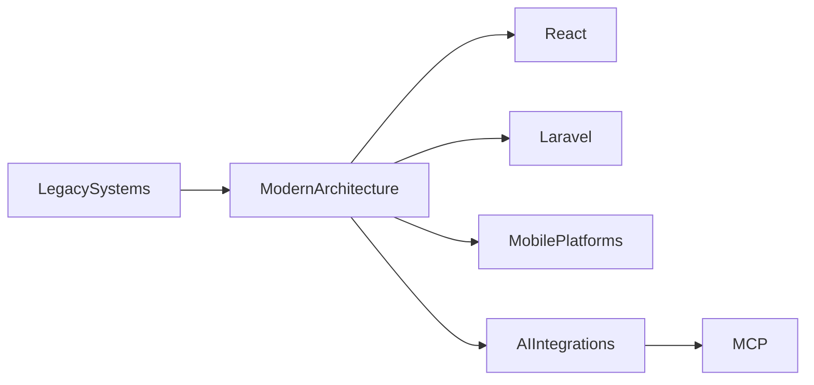

# Fenner Eduardo González Castellanos

### Staff Engineer • Tech Lead • Software Architect

Full Stack Engineer specialized in legacy modernization, scalable architectures, offline-first mobile systems and advanced quality automation.

With 8+ years of experience building enterprise solutions across SaaS, legaltech, agriculture, education and high-scale digital platforms.

Currently focused on software architecture, AI integrations, distributed systems and modern engineering ecosystems.

---

# Engineering Focus

* Software Architecture
* Technical Leadership
* Legacy Modernization
* Full Stack Engineering
* Offline-first Mobile Systems
* DevOps & CI/CD
* Testing & Quality Engineering
* AI Integrations & MCP
* Enterprise APIs & SaaS Platforms
* High Performance Frontend Architectures

---

# About Me

I’ve led modernization initiatives transforming legacy systems into scalable and maintainable ecosystems using:

* Laravel + Inertia + React
* Angular + Ionic
* React Native + SQLite
* Node.js + TypeScript
* .NET Core + PostgreSQL

My engineering approach combines:

* scalable architecture,
* automated quality,
* operational resilience,
* performance optimization,
* developer experience,
* and sustainable technical evolution.

I enjoy building systems designed not only to solve current problems, but to scale and evolve over time.

---

# Impact Highlights

* Achieved +98% automated test coverage on critical enterprise modules
* Reduced production-critical exceptions by 95% through backend hardening
* Improved CI/CD pipeline execution times by 30%
* Led technical architecture across large collaborative repositories with thousands of commits
* Designed offline-first mobile platforms with distributed synchronization
* Modernized legacy ecosystems into React/Vite/TypeScript architectures
* Built AI-ready integrations using MCP (Model Context Protocol)
* Developed scalable SaaS platforms and enterprise-grade APIs

---

# Featured Projects

## AWFY MCP Server

AI integration layer and MCP server architecture for legal and enterprise platforms.

### Stack

Node.js • TypeScript • MCP SDK • Express • REST APIs

### Highlights

* Hybrid MCP transport architecture
* AI agent integrations
* Dynamic semantic resources
* Secure HTTP bridges
* Enterprise API orchestration

---

## TOC Backend

Enterprise backend platform built with Laravel and scalable API architecture.

### Stack

Laravel • PostgreSQL • Docker • Passport • REST APIs

### Highlights

* Scalable API ecosystem
* Modular backend architecture
* Authentication & authorization
* Enterprise integrations
* CI/CD workflows

---

## Offline-first Agricultural Mobile Platform

Mobile architecture for agricultural field operations with synchronization and geolocation.

### Stack

React Native • SQLite • TypeScript • PHP Phalcon

### Highlights

* Offline-first synchronization
* Local persistence architecture
* Advanced geolocation workflows
* Operational resilience in low-connectivity environments
* Mobile performance optimization

---

## Bonabu

Modern reactive commerce platform built with Laravel, React and TypeScript.

### Stack

Laravel • Inertia.js • React • TypeScript

### Highlights

* Reactive frontend architecture
* Type-safe ecosystem
* Modular backend design
* Clean and scalable UI architecture

---

# Architecture Philosophy

I build software focused on:

* long-term maintainability,
* modular architectures,
* automated quality from day one,
* operational resilience,
* scalability and performance,
* developer experience,
* and AI-ready integrations.

I strongly believe great engineering is the balance between business goals, technical quality and sustainable architecture decisions.

---

# Tech Stack

## Backend

Laravel • PHP • Node.js • Express • .NET Core • Phalcon

## Frontend

React • Angular • Vue • TypeScript • Vite • Inertia.js

## Mobile

React Native • Ionic • Capacitor • SQLite

## Databases

PostgreSQL • MySQL • SQLite

## DevOps

Docker • GitHub Actions • AWS ECS • Linux • Nginx

## Testing

Vitest • Cypress • Jest • xUnit • Testing Library

## Architecture

Microservices • Modular Monoliths • CQRS • REST APIs • MCP

---

# Current Interests

* AI Integrations
* Model Context Protocol (MCP)
* Software Architecture
* High Performance Systems
* Developer Tooling
* Distributed Systems
* Modern Frontend Ecosystems
* DevOps Automation

---

# GitHub Analytics

  

  

---

# Engineering Evolution

---

# Connect With Me

* LinkedIn → linkedin.com/in/fennereduardo
* Portfolio → fennereduardo.com
* GitHub → github.com/FennerEduardo

---

> “Architecture is not only about building software that works today, but designing systems capable of evolving tomorrow.”
